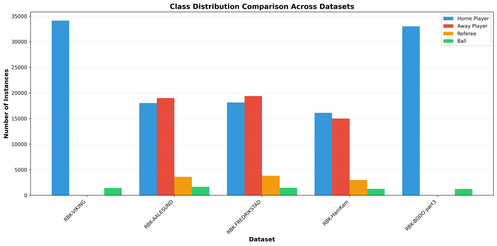
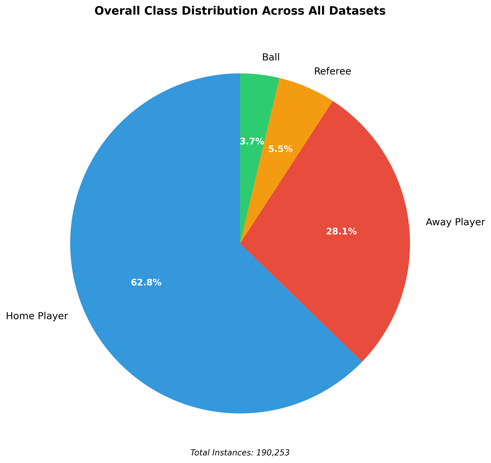

# Step 1b: Class Distribution Analysis

**Report Generated:** 2025-11-04 14:22:56

---

## Overview

This report analyzes the distribution of annotated instances across object classes:
- `home_player` - Home team players
- `away_player` - Away team players
- `referee` - Match referees
- `ball` - Football

---

## Class Distribution by Dataset

| Dataset | Home Player | Away Player | Referee | Ball | Total |
|---------|-------------|-------------|---------|------|-------|
| RBK-VIKING | 34,123 | 0 | 0 | 1,432 | 35,555 |
| RBK-AALESUND | 18,021 | 18,993 | 3,604 | 1,662 | 42,280 |
| RBK-FREDRIKSTAD | 18,126 | 19,395 | 3,818 | 1,478 | 42,817 |
| RBK-HamKam | 16,110 | 14,991 | 2,992 | 1,253 | 35,346 |
| RBK-BODO-part3 | 33,009 | 0 | 0 | 1,246 | 34,255 |
| **TOTAL** | **119,389** | **53,379** | **10,414** | **7,071** | **190,253** |

---

## Visual Analysis

### Class Distribution Comparison

*Grouped bar chart showing class counts per dataset. Missing bars indicate absent classes.*

### Overall Distribution

*Pie chart showing overall class distribution across all datasets.*

---

## Key Findings

### Overall Class Distribution

- **Home Player**: 119,389 instances (62.75%)
- **Away Player**: 53,379 instances (28.06%)
- **Referee**: 10,414 instances (5.47%)
- **Ball**: 7,071 instances (3.72%)

### Player Team Balance

- **Home players**: 69.1% (expected ~50%)
- **Away players**: 30.9% (expected ~50%)
- ⚠️ **Significant imbalance**: 19.1% deviation from expected 50/50 split

---

## Issues Identified

**Found 2 issue(s):**

### 1. RBK-VIKING: Missing Class Labels

**Missing classes**: away_player, referee

**Impact**: All players are labeled as 'home' team. This dataset lacks team distinction.

**Recommendation**: 
- Option 1: Re-annotate with proper team labels
- Option 2: Train a separate team classifier
- Option 3: Use only for player detection (not team classification)

### 2. RBK-BODO-part3: Missing Class Labels

**Missing classes**: away_player, referee

**Impact**: All players are labeled as 'home' team. This dataset lacks team distinction.

**Recommendation**: 
- Option 1: Re-annotate with proper team labels
- Option 2: Train a separate team classifier
- Option 3: Use only for player detection (not team classification)

---

## Summary

**Status**: ⚠️ Issues detected in 2 out of 5 datasets

**Datasets with complete labels**: 3
**Datasets missing team labels**: 2

**Critical Issue**: RBK-VIKING and RBK-BODO-part3 lack team classification (away_player, referee).

**Impact on Training**:
- These datasets can be used for generic player detection
- Cannot be used for team classification without additional processing
- Overall dataset has 69% home vs 31% away imbalance

---

## Recommendations

1. **For complete team classification**: Re-annotate RBK-VIKING and RBK-BODO-part3 with team labels
2. **For object detection only**: Current annotations are sufficient for detecting players, referees, and ball
3. **Hybrid approach**: Use well-labeled datasets (AALESUND, FREDRIKSTAD, HamKam) for team classification, all datasets for object detection

---

## Next Steps

Proceed to model training or optional analyses (object size, tracking stability).
