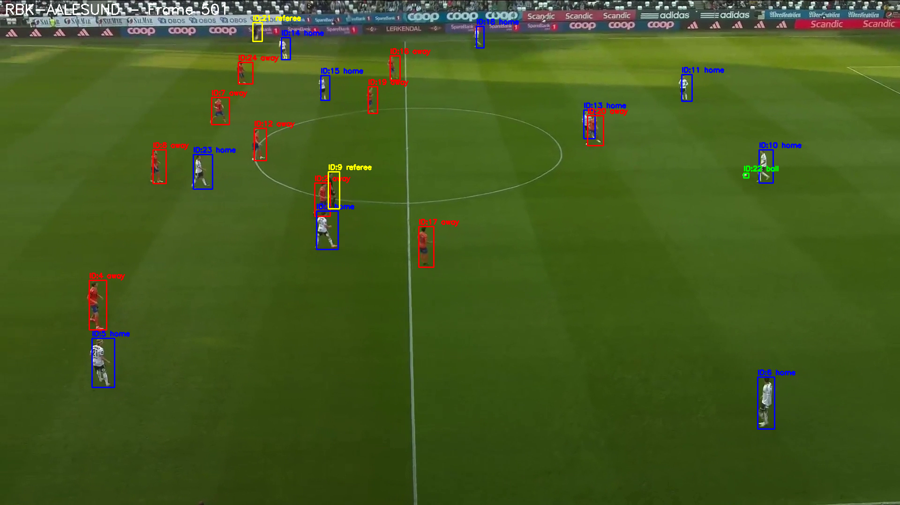

# Step 1a: Dataset Quality & Annotation Analysis

**Report Generated:** 2025-11-04 13:56:19

---

## Overview

This report presents the results of Step 1a validation, which verifies:
1. Bounding box coordinates are valid and within image boundaries
2. Tracking IDs are unique and properly assigned
3. Visual confirmation of annotations through random frame samples

---

## Dataset Statistics

| Dataset | Frames | Tracks | Boxes |
|---------|--------|--------|-------|
| RBK-VIKING | 1,523 | 25 | 35,555 |
| RBK-AALESUND | 1,802 | 47 | 42,324 |
| RBK-FREDRIKSTAD | 1,816 | 50 | 42,863 |
| RBK-HamKam | 1,523 | 28 | 35,346 |
| RBK-BODO-part3 | 1,496 | 51 | 34,307 |
| **TOTAL** | **8,160** | **201** | **190,395** |

**Note:** Track counts include both physical objects (players, referee, ball) and event label annotations (passes, shots, etc.). For example, RBK-AALESUND has 47 tracks: 24 players, 1 ball, and 22 event markers.

---

## Validation Results

### 1. Bounding Box Validation

**Status:** PASSED

**Checks performed:**
- No negative coordinates
- No zero-area boxes
- All boxes within image boundaries (1920x1080)

**Result:** All 190,395 bounding boxes validated successfully.

**Anomalies found:** 0

### 2. Tracking ID Validation

**Status:** PASSED

**Checks performed:**
- No duplicate track IDs within the same frame
- All boxes have valid track IDs

**Result:** All 201 tracks validated successfully.

**Anomalies found:** 0

### 3. Visual Inspection

**Status:** COMPLETED

**Samples generated:** 3 random frames per dataset (15 total)

**Color coding:**
- Home team: Blue
- Away team: Red
- Referee: Yellow
- Ball: Green

**Example Visualization:**

*RBK-AALESUND Frame 501 - Showing annotated bounding boxes with track IDs and team colors*

**All visualizations location:** `./visualizations/`

---

## Summary

All datasets passed validation with no issues detected:

- All bounding box coordinates are valid and within boundaries
- All tracking IDs are unique and properly assigned
- Annotations are visually confirmed to be correctly labeled

**Conclusion:** The dataset quality is excellent and ready for model training.

---

## Next Steps

Proceed to **Step 1b: Class Distribution Analysis** to verify dataset balance.
