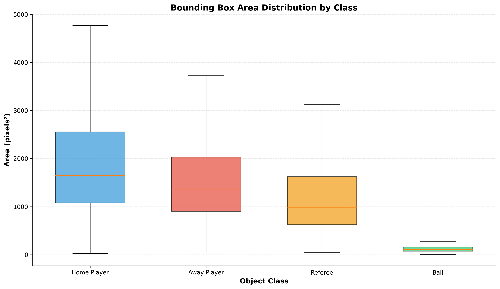
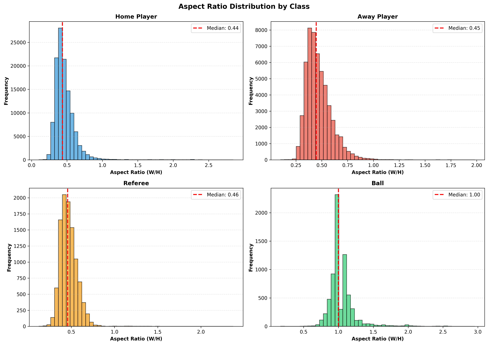

# Step 2a: Object Size and Scale Analysis

**Report Generated:** 2025-11-04 15:37:53

---

## Overview

This analysis examines bounding box sizes and aspect ratios to inform model configuration:
- **Anchor box sizes** for detection models
- **Input resolution** requirements
- **Data augmentation** strategies

---

## Summary Statistics

| Class | Mean Area (px²) | Median Area (px²) | Mean Aspect Ratio | Median Aspect Ratio | Sample Count |
|-------|----------------|------------------|-------------------|---------------------|--------------|
| Home Player | 2029 | 1647 | 0.47 | 0.44 | 119,389 |
| Away Player | 1627 | 1364 | 0.47 | 0.45 | 53,379 |
| Referee | 1205 | 987 | 0.47 | 0.46 | 10,414 |
| Ball | 126 | 110 | 1.05 | 1.00 | 7,071 |

---

## Visual Analysis

### Bounding Box Area Distribution

*Box plots showing the distribution of bounding box areas for each object class.*

### Aspect Ratio Distribution

*Histograms showing aspect ratio (width/height) distributions. Critical for anchor box design.*

---

## Key Findings

### 1. Object Size Hierarchy

- **Home Player**: 2029 px² (avg), 0.098% of image area
- **Away Player**: 1627 px² (avg), 0.078% of image area
- **Referee**: 1205 px² (avg), 0.058% of image area
- **Ball**: 126 px² (avg), 0.006% of image area

### 2. Aspect Ratios

- **Players & Referee**: ~0.45-0.47 (tall, narrow - approximately 2:1 height:width ratio)
- **Ball**: ~1.0 (square/circular)

### 3. Size Variation

- **Home Player**: 457.4x range (min: 29 px², max: 13108 px²)
- **Away Player**: 411.1x range (min: 33 px², max: 13728 px²)
- **Referee**: 158.8x range (min: 42 px², max: 6592 px²)
- **Ball**: 62.9x range (min: 7 px², max: 462 px²)

### 4. Ball Detection Challenge

- Ball is **~16x smaller** than players on average
- Minimum ball area: 7 px² (very small object)
- Requires **multi-scale detection** capabilities

---

## Recommendations for Model Configuration

### 1. Anchor Box Sizes

Based on aspect ratio analysis, recommended anchor configurations:

**Players (Home/Away/Referee):**
- Aspect ratios: **0.4, 0.45, 0.5**
- Sizes (width × height): 
  - Small: ~19 × 43
  - Medium: ~27 × 61
  - Large: ~40 × 92

**Ball:**
- Aspect ratio: **1.0** (square)
- Size: ~10 × 10

### 2. Input Resolution

- **Recommended**: 1280×720 or higher
- **Rationale**: Ball detection requires preserving small object details
  - Minimum ball size is 7 px² at 1920×1080
  - Lower resolutions may lose critical ball information

### 3. Data Augmentation

- **Scale augmentation**: ±30-50% (based on observed size variation)
- **Aspect ratio**: Keep within 0.3-0.6 for players, 0.8-1.2 for ball
- **Multi-scale training**: Essential for handling ball vs player size difference

### 4. Model Architecture Considerations

- Use **Feature Pyramid Network (FPN)** or similar multi-scale architecture
- Enable **small object detection** layers
- Consider separate detection heads for ball vs players due to size disparity

---

## Summary

**Key Insights:**
- Players have consistent aspect ratios (~0.45-0.47) suitable for tall anchor boxes
- Ball is significantly smaller, requiring dedicated small-object detection strategies
- Large size variation within classes (up to 450x for ball) necessitates multi-scale approach

**Next Steps:**
- Apply recommended anchor configurations in detection model
- Use input resolution ≥720p to preserve small object details
- Implement multi-scale data augmentation during training

---
