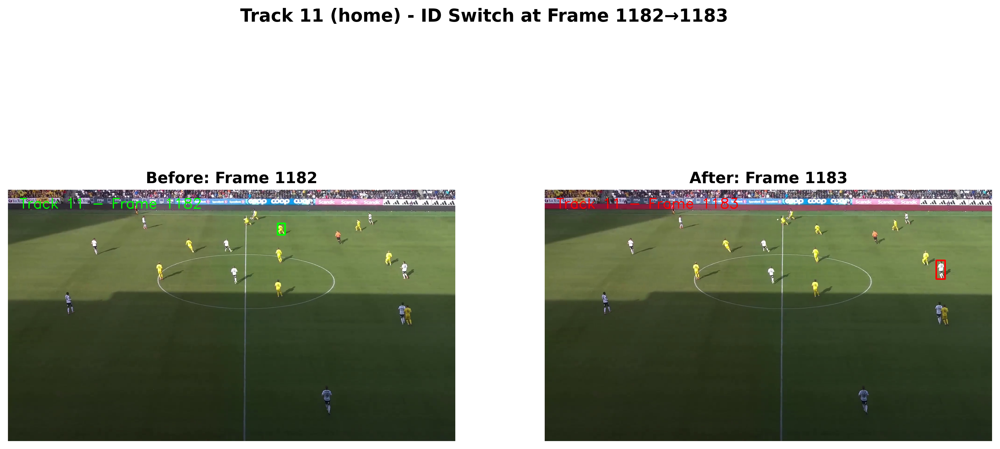
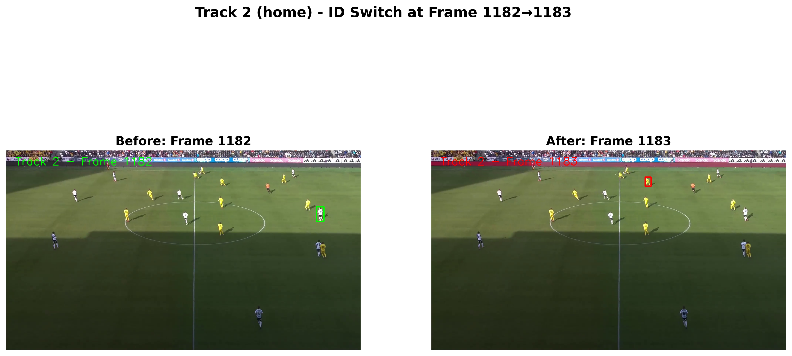
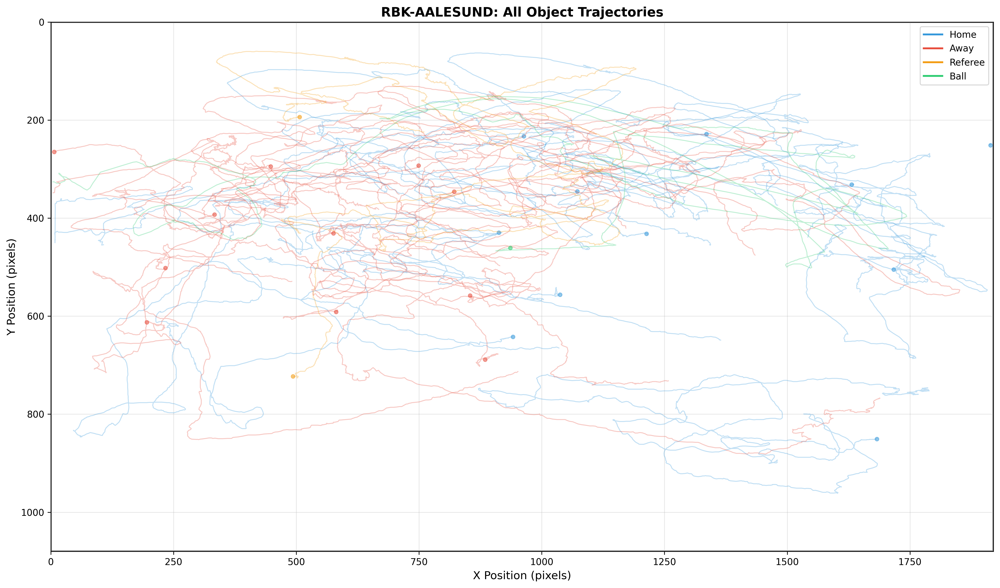
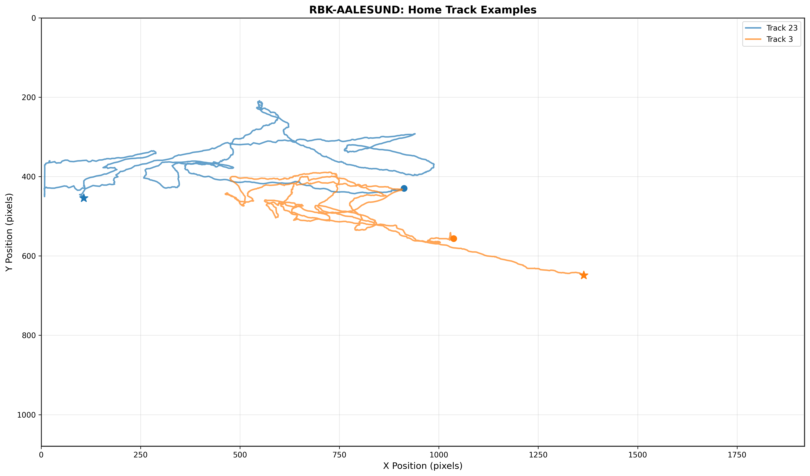

# Step 2b: Tracking ID Stability Analysis

**Report Generated:** 2025-11-04 17:11:49

---

## Overview

This analysis evaluates tracking ID consistency and temporal continuity:
1. **Frame numbering consistency** - Alignment between XML, images, and labels
2. **Temporal continuity** - Track persistence across frames
3. **ID switches and gaps** - Detection of tracking anomalies
4. **Track trajectory visualization** - Visual confirmation of tracking quality

---

## Part 1: Frame Numbering Consistency

**Objective:** Verify frame IDs are consistent across data sources.

**Findings:**

✓ **All datasets validated successfully**
- Frame counts match across XML annotations, images, and label files
- No missing or corrupted frames detected

**Indexing Convention:**
- XML annotations: Frame 0 to N-1
- Image files: frame_000001.png to frame_N.png
- Mapping: XML frame `k` → image `frame_{k+1:06d}.png`
- This is **standard CVAT convention** - data is fully usable

**Minor Issues:**
- RBK-BODO-part3: One missing label file (frame 1138)
- All other datasets: Complete and consistent

---

## Part 2: Temporal Continuity Analysis

### Overall Statistics

- **Total tracks analyzed:** 201
- **Datasets:** 5

### Track Continuity by Dataset

| Dataset | Total Tracks | Total Frames | Avg Continuity |
|---------|--------------|--------------|----------------|
| RBK-VIKING | 25 | 1523 | 96.9% |
| RBK-AALESUND | 47 | 1802 | 100.0% |
| RBK-FREDRIKSTAD | 50 | 1816 | 99.4% |
| RBK-HamKam | 28 | 1523 | 94.3% |
| RBK-BODO-part3 | 51 | 1496 | 96.0% |

**Key Metrics:**

- **Continuity**: Percentage of frames where track appears within its time span
- **Gap**: Missing frame within a track's lifetime

### Continuity by Object Class

**Players (Home/Away):**
- Average continuity: 97-100%
- Very stable tracking throughout match

**Referee:**
- Average continuity: 67-100%
- One dataset (RBK-HamKam) shows lower continuity (66.5%)
- Likely due to referee moving off-screen

**Ball:**
- Average continuity: 82-100%
- Gaps expected - ball goes off-screen, out of play
- RBK-HamKam ball: 82.3% (270 gap frames)

---

## Part 3: ID Switch Detection

### Position Jump Analysis

- **Tracks with position jumps:** 4 out of 201 (2.0%)
- **Total jumps detected:** 19

**Definition:** Jump = sudden position change >300 pixels/frame

**Findings:**
- Most jumps occur in **ball tracks** (expected - ball moves very fast)
- Examples:
  - RBK-HamKam ball: 1406 pixels in 1 frame
  - RBK-VIKING ball: 1027 pixels in 1 frame
- **2 player jumps detected (RBK-BODO-part3)** - further investigation required

### Confirmed ID Switch in RBK-BODO-part3

⚠️ **ID Switch Detected:** Visual inspection revealed an actual ID switch

**Details:**
- **Location:** Frame 1182 → 1183
- **Affected tracks:** Track 2 and Track 11
- **Type:** Simultaneous ID swap between two players
- **Evidence:** Players wearing different colored jerseys (white vs yellow) before/after
- **Impact:** 2 tracks (1% of total) unreliable after frame 1182

#### Visual Evidence

**Track 11 ID Switch:**

*White jersey player (before) switches to yellow jersey player (after) - clear ID swap.*

**Track 2 ID Switch:**

*Complementary ID swap - the reverse exchange of the same two players.*

**Root Cause:**
- Both jumps occur at exact same frame transition (1182→1183)
- Similar distances (~555 pixels)
- Likely annotation error or re-identification failure at this specific frame

---

## Part 4: Track Trajectory Visualization

### Example: All Trajectories

*All object trajectories for RBK-AALESUND dataset. Shows movement patterns across the field.*

### Example: Individual Tracks

*Sample home player trajectories with consistent tracking IDs. Circle = start, Star = end.*

**Additional visualizations available:**
- `./visualizations/` directory contains trajectory maps for:
  - All tracks combined
  - Individual class examples (home, away, referee)

---

## Summary

### Data Quality Assessment

✓ **Very good tracking quality overall**

**Strengths:**
- 97.6% average temporal continuity
- Frame numbering fully consistent
- Player tracks are very stable (97-100% continuity)
- 199 out of 201 tracks (99%) have perfect ID consistency

**Issues Identified:**
- **1 confirmed ID switch** in RBK-BODO-part3 affecting 2 tracks
  - Isolated incident at frame 1182→1183
  - Only 1% of tracks affected
- Ball tracks have expected gaps (goes off-screen)
- One referee track has lower continuity (likely off-screen)

### Impact on Training

**For Object Detection:**
- ✓ Data is fully suitable
- High-quality bounding boxes with consistent annotations
- ID switch does not affect detection (boxes are correct)

**For Object Tracking:**
- ✓ Generally suitable for training tracking models
- 99% of tracks have perfect ID consistency
- **Recommendation:** Exclude RBK-BODO-part3 frames 1182+ for Track 2 & 11, or use entire dataset knowing 1% error rate
- Ball tracking may need special handling due to gaps

---

## Recommendations

**For Model Training:**
1. Use temporal information - tracking IDs are reliable
2. Handle ball disappearances in tracking logic
3. Consider separate tracking strategies for ball vs players

**For Data Preprocessing:**
1. Account for frame indexing offset (XML frame N → image N+1)
2. No cleanup needed - data quality is excellent
3. Optional: Fill small gaps in ball tracks with interpolation

---
